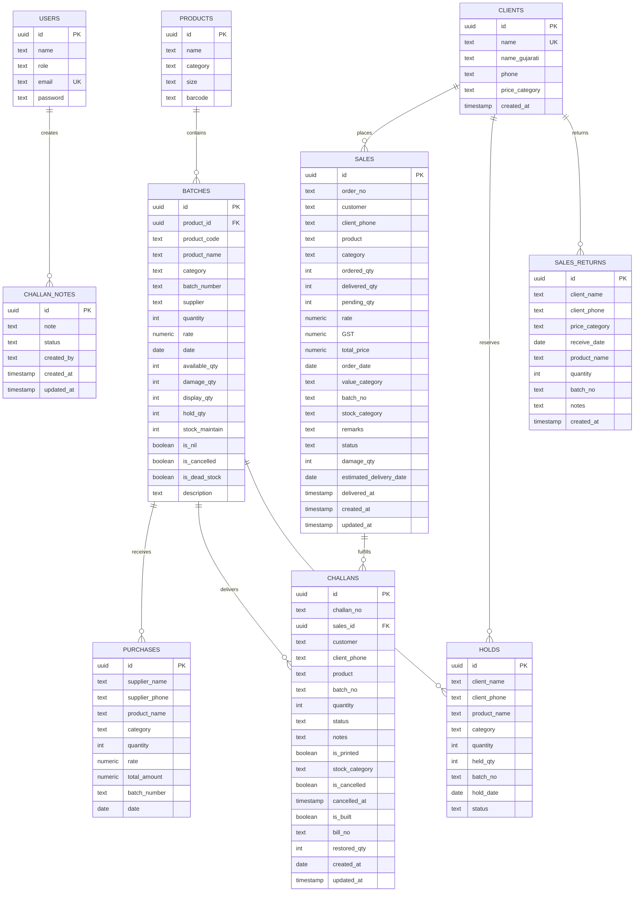
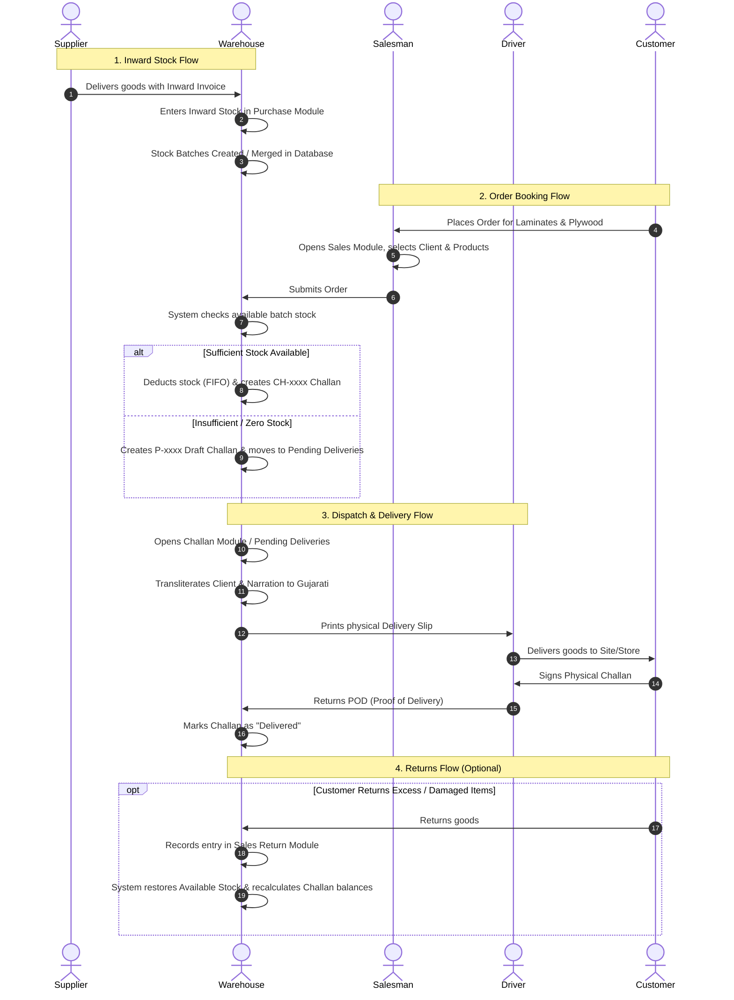
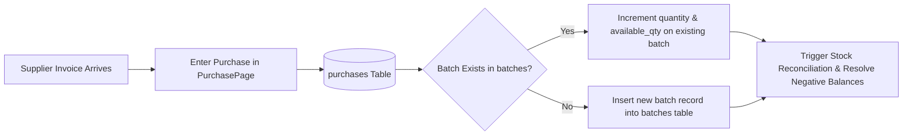

# Sonaply ERP — Complete System Architecture, Module Workflows & Technical Documentation

> **Document Version:** 1.0.0  
> **Last Updated:** September 2026  
> **System Purpose:** Enterprise Inventory, Order Fulfillment, Production/Stock Tracking, and Logistics Management System for Plywood & Laminate Industry.

---

## Table of Contents

1. [Executive Summary & System Overview](#1-executive-summary--system-overview)
2. [Technology Stack & Architecture](#2-technology-stack--architecture)
3. [Database Schema & Data Models](#3-database-schema--data-models)
4. [Third-Party APIs & External Integrations](#4-third-party-apis--external-integrations)
5. [Cross-Module Data Flow & Life-Cycle Diagrams](#5-cross-module-data-flow--life-cycle-diagrams)
6. [In-Depth Module Workflows & Functional Specifications](#6-in-depth-module-workflows--functional-specifications)
   - 6.1 [Dashboard Module (`/`)](#61-dashboard-module-)
   - 6.2 [Stock List Module (`/stock`)](#62-stock-list-module-stock)
   - 6.3 [Stock Entry Module (`/stock-entry`)](#63-stock-entry-module-stock-entry)
   - 6.4 [Purchase Management Module (`/purchases`)](#64-purchase-management-module-purchases)
   - 6.5 [Sales & Order Booking Module (`/sales`)](#65-sales--order-booking-module-sales)
   - 6.6 [Sales Return Module (`/sales-returns`)](#66-sales-return-module-sales-returns)
   - 6.7 [Stock Hold & Reservation Module (`/holds`)](#67-stock-hold--reservation-module-holds)
   - 6.8 [Pending Deliveries Module (`/pending-orders`)](#68-pending-deliveries-module-pending-orders)
   - 6.9 [Delivered Deliveries Module (`/delivered-orders`)](#69-delivered-deliveries-module-delivered-orders)
   - 6.10 [Delivery Challan Management Module (`/challans`)](#610-delivery-challan-management-module-challans)
   - 6.11 [Daily Export & Audit Module (`/export`)](#611-daily-export--audit-module-export)
   - 6.12 [Clients Master Module (`/clients`)](#612-clients-master-module-clients)
   - 6.13 [User Management & Security Module (`/users`)](#613-user-management--security-module-users)
7. [Stock Calculation Formulas & Reconciliation Engine](#7-stock-calculation-formulas--reconciliation-engine)
8. [Backend API Reference Catalog](#8-backend-api-reference-catalog)
9. [Deployment, Security & Production Recommendations](#9-deployment-security--production-recommendations)

---

## 1. Executive Summary & System Overview

**Sonaply ERP** is a specialized, full-stack Enterprise Resource Planning application designed for wholesale and retail distributors in the decorative laminates, acrylic sheets, and plywood industries. 

The software automates the end-to-end operational life-cycle:
- **Inward Logistics:** Purchasing, batch classification, inventory merging, and supplier tracking.
- **Inventory Control:** Real-time visibility into Available, Display, Damage, Dead Stock, Nil Stock, and Held/Reserved quantities across multiple product categories.
- **Sales & Order Booking:** Multi-item cart management, client credit/pricing classification, instantaneous inventory reservation, and WhatsApp dispatch messaging.
- **Order Fulfillment & Logistics:** Automatic splitting of orders into immediate Delivery Challans (`CH-` prefix) and backorder draft Challans (`P-` prefix), pending delivery queues, proof of delivery slips, and sales return reconciliation.
- **Multilingual Support:** Phonetic English-to-Gujarati transliteration for local dispatch labels, client names, and challan narrations.

---

## 2. Technology Stack & Architecture

### 2.1 Architecture Overview

```
┌─────────────────────────────────────────────────────────────┐
│                       Client Tier                           │
│  React 18 + TypeScript + Vite + Tailwind CSS + shadcn/ui    │
└──────────────────────────────┬──────────────────────────────┘
                               │ HTTP / JSON (Port 8080)
                               ▼
┌─────────────────────────────────────────────────────────────┐
│                 Vite Reverse Proxy Server                   │
│         Maps `/api/*` ──► `http://localhost:5000/api/*`     │
└──────────────────────────────┬──────────────────────────────┘
                               │ RESTful API
                               ▼
┌─────────────────────────────────────────────────────────────┐
│                     Application Server                      │
│             Node.js + Express.js (Port 5000)                │
│   • FIFO Stock Allocator       • Challan Reconciler         │
│   • Transaction Coordinator    • Stock Resolvers            │
└──────────────────────────────┬──────────────────────────────┘
                               │ Connection Pool (`pg`)
                               ▼
┌─────────────────────────────────────────────────────────────┐
│                       Database Tier                         │
│               PostgreSQL Database Engine                    │
│   • ACID Transactions          • Performance B-Tree Indexes │
│   • Relational Integrity       • Constraint Validation      │
└─────────────────────────────────────────────────────────────┘
```

### 2.2 Technical Component Breakdown

| Layer | Technologies Used | Purpose |
|---|---|---|
| **Frontend UI** | React 18.3, TypeScript 5.8, Vite 5.4 | High-performance SPA with type safety and rapid HMR. |
| **State & Cache** | TanStack React Query v5 | Server state caching, background polling, and optimistic updates. |
| **Component Library** | shadcn/ui, Radix UI primitives | Accessible, consistent modal dialogs, popovers, selects, and toasts. |
| **Styling** | Tailwind CSS 3.4, PostCSS, Lucide Icons | Responsive styling, print stylesheets (`no-print`), clean aesthetics. |
| **Visual Analytics** | Recharts 2.15 | Monthly sales trends, stock distribution, category charts. |
| **Spreadsheets** | SheetJS (`xlsx` 0.18.5) | Client template generation and bulk Excel/CSV import and export. |
| **Backend API** | Node.js, Express.js 4.x | REST API endpoints, transactions, stock allocation, and reconciliation algorithms. |
| **Database** | PostgreSQL, `pg` (node-postgres) | Persistent ACID database with JSON handling and UUID primary keys. |

---

## 3. Database Schema & Data Models

The system is powered by PostgreSQL with 10 core tables:



---

## 4. Third-Party APIs & External Integrations

### 4.1 Google Input Tools API (Phonetic Gujarati Transliteration)

- **API Endpoint:**  
  `https://inputtools.google.com/request?text={WORD}&itc=gu-t-i0-und&num=5&cp=0&cs=1&ie=utf-8&oe=utf-8&app=test`
- **Method:** `GET`
- **Purpose:** Automatically transliterates English text (e.g., `"Vrundavan Timber"`, `"Urgent deliver to sitework"`) into Gujarati script (`"વૃંદાવન ટીમ્બર"`).
- **Where It Is Used:**
  1. **Clients Master (`ClientsPage.tsx`):** The "Auto Convert to Gujarati" button takes the English client name and populates the `nameGujarati` / `name_gujarati` database column.
  2. **Delivery Challan Printing (`ChallanPage.tsx`):** When generating delivery slips and challans for the warehouse team and truck drivers, the client name and narration notes are converted to Gujarati script on the physical printout.
  3. **Offline Trade Dictionary Fallback:** `src/lib/utils.ts` embeds a `COMMON_TRADE_MAP` containing over 50 industry terms (e.g., `PLYWOOD` ➔ `પ્લાયવુડ`, `HARDWARE` ➔ `હાર્ડવેર`, `DOOR` ➔ `ડોર`, `INTERIOR` ➔ `ઇન્ટિરિયર`) to ensure 100% accurate trade transliteration even before making the network request.

### 4.2 WhatsApp Direct Messaging Integration

- **API Protocol:** Standard WhatsApp Universal Deep Link (`https://wa.me/{phone}?text={encoded_message}`)
- **Purpose:** Allows staff to send order confirmations, dispatches, and delivery slips directly to customers' WhatsApp numbers in a single click without saving their number in mobile contacts.
- **Where It Is Used:**
  - `SalesPage.tsx`: The "Send WhatsApp" icon on grouped orders constructs a formatted message detailing:
    - Customer Name & Order ID
    - List of products & quantities
    - Delivery status & delivery date

### 4.3 SheetJS (`xlsx`) Excel Parser & Generator

- **Purpose:** Client data import and bulk operations.
- **Where It Is Used:**
  - `ClientsPage.tsx`: Generates a downloadable `client_import_template.xlsx` and parses uploaded `.xlsx` / `.csv` spreadsheets with duplicate detection and error reporting.

### 4.4 Browser Native Print & Canvas Engine (`print.ts` & `html2canvas`)

- **Purpose:** Clean, high-resolution thermal and standard A4/A5 printouts for delivery challans, picking lists, and daily sales summaries. Removes all UI headers and sidebars (`@media print` / `.no-print`).

---

## 5. Cross-Module Data Flow & Life-Cycle Diagrams

### 5.1 End-to-End Inventory & Sales Order Life Cycle



---

## 6. In-Depth Module Workflows & Functional Specifications

---

### 6.1 Dashboard Module (`/`)

#### Purpose & Scope
The Executive Dashboard provides management with a real-time operational overview of company performance, revenue, inventory health, and delivery metrics.

```
┌────────────────────────────────────────────────────────────────────────┐
│  [Total Sales]        [Available Stock]    [Display Stock]   [Damage]  │
│     ₹ 4,85,200           12,450 Sheets         320 Sheets     45 Sheets│
├────────────────────────────────────────────────────────────────────────┤
│  [Monthly Sales Trend (Bar/Line Chart)]   [Category Distribution]      │
│  [Recent Orders Table]                    [Pending Deliveries Alert]   │
└────────────────────────────────────────────────────────────────────────┘
```

#### Key Metrics & Visualizations
1. **Financial & Volume KPIs:**
   - Total sales value (₹) and sheet count.
   - Total Available sheets across all warehouses.
   - Total Display and Damage stock.
2. **Monthly Sales Revenue Charts:** Interactive Bar/Area charts powered by Recharts comparing month-over-month performance.
3. **Category Breakdown:** Graphical distribution of sales across product lines (`FINE TOUCH`, `FINOBLE`, `REAL PLUS`, `ROXX LAM`, `ACRIKA`, etc.).
4. **Actionable Alerts:** Count of pending delivery orders requiring procurement or warehouse dispatch.

---

### 6.2 Stock List Module (`/stock`)

#### Purpose & Scope
The central inventory repository of the ERP. It provides granular visibility, batch-level tracking, complex multi-column filtering, inline editing, and classification of all physical sheets.

#### Key Features & Columns
| Column | Description & Business Use | Filter Options |
|---|---|---|
| **Product** | Name of the laminate/plywood sheet (e.g., `101 SF`, `804 Gloss`). | Search autocomplete with distinct value lookup. |
| **Category** | Product brand/line (e.g., `FINE TOUCH`, `FINOBLE`, `KALAA`). | Dropdown selection of all active categories. |
| **Batch** | Manufacturer batch number. `0` indicates general/unassigned batch. | Text filter with distinct batch suggestion. |
| **Sold Qty** | Calculated sold quantity: `quantity - available - display - damage - hold`. | Presets: `>0`, `=0`, `<0`, Custom Range (Min/Max). |
| **Available Qty** | Immediately fulfillable stock available for new customer orders. | Presets: `>0`, `=0`, `<0`, Custom Range (Min/Max). |
| **Stock Maintain** | Minimum buffer/safety threshold to alert before stockout. | Presets: `>0`, `=0`, `<0`, Custom Range (Min/Max). |
| **Hold Qty** | Stock temporarily reserved for clients via Hold module. | Presets: `>0`, `=0`, Custom Range (Min/Max). |
| **Display Qty** | Sample folder / showroom display stock (cannot be sold as regular). | Presets: `>0`, `=0`, Custom Range (Min/Max). |
| **Damage Qty** | Broken, cracked, or defective sheets isolated from regular sale. | Presets: `>0`, `=0`, Custom Range (Min/Max). |
| **Description** | Notes regarding surface finish, grain, or location. | Text substring filter. |
| **Updated Date** | Date of last inward purchase or physical stock audit. | Date matching (YYYY-MM-DD or DD-MM-YYYY). |

#### Specialized Stock Classification Flags
1. **Regular Stock:** Standard active inventory available for ongoing sales.
2. **Not in Next Folder (`is_cancelled = TRUE`):** Discontinued patterns or laminates that will not appear in upcoming product catalogues.
3. **Dead Stock (`is_dead_stock = TRUE`):** Slow-moving or discontinued designs marked for clearance discounts.
4. **Nil Stock (`is_nil = TRUE`):** Zero-inventory items retained in the system for tracking demand and reordering history.

#### Actions & Operations
- **Server-Side Pagination:** Efficient chunk loading (50 items per page) with real-time aggregate statistics.
- **Admin-Protected Edits & Deletions:** Editing quantities or deleting stock batches requires security authentication (`admin`).
- **Export to CSV:** Downloads currently filtered inventory for external spreadsheet analysis.

---

### 6.3 Stock Entry Module (`/stock-entry`)

#### Purpose & Scope
Used by warehouse supervisors to quickly enter new incoming stock batches or make manual inventory adjustments without creating a full vendor purchase bill.

#### Workflow
1. Select or type **Product Name** and **Category**.
2. Enter **Batch Number**, **Quantity**, **Supplier Name**, and **Rate**.
3. Specify optional sub-allocations: **Display Qty**, **Damage Qty**, **Stock Maintain threshold**, and **Description**.
4. **Automatic Merging:** The system verifies if an identical product and batch already exist:
   - If found, it increments the existing batch's `quantity` and `available_qty`.
   - If not found, it creates a new batch record in the `batches` table.

---

### 6.4 Purchase Management Module (`/purchases`)

#### Purpose & Scope
Tracks all vendor procurement orders, supplier details, invoices, and inward goods receipts.

#### Workflow & Automatic Stock Sync


- **Fields:** Supplier Name, Supplier Phone, Product Name, Category, Inward Quantity, Unit Rate, Total Amount (`quantity * rate`), Batch Number, Inward Date.
- **Stock Synchronization:** Every purchase automatically adds inventory to the `batches` table in real-time.

---

### 6.5 Sales & Order Booking Module (`/sales`)

#### Purpose & Scope
The primary order booking engine used by sales staff. Handles single-item and multi-item orders, customer credit management, instant hold creation, price calculation, and delivery scheduling.

#### Workflow & Logic
1. **Client Selection:** Select an existing client or enter a new customer name and phone. The system automatically upserts the client in the `clients` table.
2. **Multi-Item Order Cart:** Add multiple laminate designs, quantities, batch preferences, and stock category selections (`Available`, `Display`, or `Damage`).
3. **Real-Time Stock Verification & Split Challan Allocation:**
   - **Fulfillable Stock Available:** The backend creates an active Delivery Challan with prefix `CH-` (e.g., `CH-1024`).
   - **Shortage / Backorder:** If the order quantity exceeds available stock, the fulfillable portion is assigned to `CH-` and the remaining backorder portion is assigned a draft challan with prefix `P-` (e.g., `P-1024`), routed to **Pending Deliveries**.
4. **FIFO Stock Deduction:** The backend immediately deducts inventory from matching batches in First-In-First-Out date order.
5. **Instant WhatsApp Notification:** One click generates an encoded WhatsApp message with complete order details ready to send to the client.
6. **Direct Hold from Sales:** Salesmen can place items on hold directly from the cart if a client wants to reserve stock before finalizing the order.

---

### 6.6 Sales Return Module (`/sales-returns`)

#### Purpose & Scope
Handles inward customer returns of undamaged or damaged goods, credit return adjustments, and automatic inventory restoration.

#### Workflow & Inventory Mechanics
1. **Enter Return Details:** Select Client, Product, Returned Quantity, Batch Number, Receive Date, and Reason/Notes.
2. **Automatic Stock Inward:**
   - The backend increases `available_qty` on the corresponding product batch.
   - If no batch exists, a return batch (`RET-xxxx`) is generated automatically.
3. **Challan Return Balancing Engine:**
   - The system tracks returns per `(client, product, batch)` tuple.
   - On the Challan screen, returned quantities are dynamically deducted from active customer challans to ensure invoices reflect accurate delivered quantities.

---

### 6.7 Stock Hold & Reservation Module (`/holds`)

#### Purpose & Scope
Allows clients to reserve high-demand sheets for ongoing architectural projects for a limited time without generating an immediate delivery invoice.

```
┌─────────────────────────────────────────────────────────────┐
│                       HOLD WORKFLOW                         │
│                                                             │
│  [Hold Requested] ──► Deduct available_qty, Add hold_qty    │
│                                │                            │
│               ┌────────────────┴────────────────┐           │
│               ▼                                 ▼           │
│     [Release to Order]                  [Cancel Hold]       │
│  • Creates active Sale & Challan     • Restores available_qty│
│  • Decrements hold_qty               • Decrements hold_qty  │
└─────────────────────────────────────────────────────────────┘
```

#### Actions
1. **Create Hold:** Deducts `available_qty` from batches and increments `hold_qty`. The stock is locked and cannot be sold to other customers.
2. **Release Hold (Convert to Sale):** Generates a confirmed Sale and Delivery Challan (`CH-` or `P-`) under a new Order number, and reduces `hold_qty`.
3. **Cancel Hold:** Releases the locked inventory back to `available_qty` and clears the hold record.

---

### 6.8 Pending Deliveries Module (`/pending-orders`)

#### Purpose & Scope
The operations tracking screen for backorders and unfulfilled items. Displays all orders where `pending_qty > 0` or draft `P-` challans exist.

#### Features & Actions
- **Grouped by Customer / Order:** Shows all pending items under each order header.
- **Estimated Delivery Date Tracking:** Allows warehouse staff to set and filter by expected stock arrival date.
- **Generate Fulfillment Challan:** Once new inward stock arrives, clicking "Generate Challan" converts the pending `P-` draft into an active `CH-` Delivery Challan, ready for physical loading and dispatch.
- **Order Classification Checkboxes:** Persistent visual flags for warehouse dispatch teams to mark orders currently being packed.

---

### 6.9 Delivered Deliveries Module (`/delivered-orders`)

#### Purpose & Scope
Historical archive of all completed customer deliveries.

#### Features
- Search and filter by Customer Name, Phone, Delivery Date range, Product, and Bill Number.
- **Order Modification & Product Replacement:** Allows admins to replace delivered items (e.g., if a wrong sheet was dispatched and swapped on site) with automatic reverse stock adjustments.
- **Print Duplicate Delivery Slips:** Generates re-prints of past delivered orders with original timestamps.

---

### 6.10 Delivery Challan Management Module (`/challans`)

#### Purpose & Scope
The core dispatch and logistics engine. Manages packing slips, physical delivery challans, billing numbers, and print layouts.

#### Key Workflows
1. **Challan Statuses:**
   - `Pending`: Draft / backorder stage (`P-` prefix).
   - `Confirmed`: Ready for picking and dispatch (`CH-` prefix).
   - `Delivered`: Physical delivery confirmed by customer signature.
   - `Cancelled`: Dispatched cancelled; stock restored to inventory.
2. **English-to-Gujarati Print Generation:**
   - Converts customer names and transport notes into Gujarati script using the Google Input Tools API.
   - Formats physical challans with: Company Header, Challan Number, Date, Gujarati Client Name, Product Code, Batch, Quantity, Narration, and Signature blocks.
3. **Delivery Slips vs Full Challans:**
   - Supports compact delivery slips (for driver hand-receipts) and full detailed tax challans.
4. **Cancellation & Stock Restoration:**
   - Cancelling a challan automatically calculates unapplied returns, restores stock to available batches, and cancels linked sales items.
5. **Bill No Tracking:** Update and assign financial accounting Bill/Invoice numbers to completed challans.

---

### 6.11 Daily Export & Audit Module (`/export`)

#### Purpose & Scope
Provides daily operational reporting and data export tools for accounting reconciliation and management auditing.

#### Features
- **Daily Operations Snapshot:** Filter by specific calendar date to view all sales, deliveries, returns, and purchases that occurred on that day.
- **One-Click Excel / CSV Export:** Exports formatted datasets for external accounting software (e.g., Tally, Busy, QuickBooks).

---

### 6.12 Clients Master Module (`/clients`)

#### Purpose & Scope
Central customer directory managing client contact information, pricing categories, and Gujarati name translations.

#### Key Features
1. **Bilingual Client Directory:** Stores English `name` and Gujarati `nameGujarati`.
2. **One-Click Auto Convert:** Uses Google Input Tools API to phonetically convert typed English names to Gujarati.
3. **Price Categories:** Assigns clients to `Regular`, `Premium`, `Wholesale`, or `VIP` price tiers.
4. **Bulk Excel Import with Conflict Resolution:**
   - Upload customer lists via `.xlsx` / `.csv`.
   - Automatically detects duplicate client names and phone numbers.
   - Skips conflicts and provides a detailed import log with reasons for skipped entries.
5. **Template Download:** Generates formatted `client_import_template.xlsx` for standardized data entry.

---

### 6.13 User Management & Security Module (`/users`)

#### Purpose & Scope
Role-Based Access Control (RBAC) restricted to Administrator users.

#### Roles & Permissions Matrix
| Feature / Module | Admin | Staff |
|---|:---:|:---:|
| **Dashboard, Sales, Purchases, Challans, Holds** | Full Access | Full Access |
| **Stock List View & Inward Entry** | Full Access | Full Access |
| **Batch Deletion & Stock Overwrites** | Requires Password | Restricted |
| **User Management (`/users`)** | Full Access | Hidden from Sidebar |
| **Cancel Delivered Orders** | Full Access | Restricted |

---

## 7. Stock Calculation Formulas & Reconciliation Engine

### 7.1 Core Inventory Formulas

$$\text{Sold Qty} = \max(0, \text{Quantity} - \text{Available Qty} - \text{Display Qty} - \text{Damage Qty} - \text{Hold Qty})$$

$$\text{Available Qty} = \text{Initial Quantity} - \sum(\text{Active Challan Qty}) + \sum(\text{Sales Return Qty}) - \text{Display Qty} - \text{Damage Qty} - \text{Hold Qty}$$

$$\text{Pending Order Qty} = \max(0, \text{Ordered Qty} - \text{Delivered Qty})$$

### 7.2 Automated Reconciliation Algorithms (Backend)

1. **`reconcileAllProductStocks(productName)`:**
   - Runs across all batches in PostgreSQL.
   - Sums all active non-cancelled challan quantities.
   - Sums all sales return quantities.
   - Resets and syncs `available_qty` to prevent inventory drift.
2. **`resolveNegativeStock(productName)`:**
   - If emergency sales cause a batch to drop below 0, this algorithm automatically sweeps positive quantities from newer incoming batches of the same product to neutralize the negative balance.
3. **`reconcilePendingChallans()`:**
   - Removes orphaned or duplicate draft `P-` challans when active `CH-` challans fully cover the customer's pending order quantity.

---

## 8. Backend API Reference Catalog

| HTTP Method | Route | Description | Request Body / Query Params |
|---|---|---|---|
| **POST** | `/api/login` | Authenticate user | `{ email, password }` |
| **GET** | `/api/batches` | Paginated stock list with filters | `?page=&limit=&search=&category=&stockStatus=&product=&batch=...` |
| **POST** | `/api/batches` | Create new stock batch | `{ product_name, category, batch_number, quantity, available_qty, ... }` |
| **PUT** | `/api/batches/:id` | Update batch details | `{ available_qty, display_qty, damage_qty, rate, ... }` |
| **DELETE** | `/api/batches/:id` | Delete stock batch | - |
| **GET** | `/api/batches/distinct-column-values` | Autocomplete filter suggestions | `?column=product_name&search=...` |
| **GET** | `/api/purchases` | List purchase records | - |
| **POST** | `/api/purchases` | Inward purchase & sync stock | `{ supplier_name, product_name, quantity, rate, batch_number, ... }` |
| **GET** | `/api/sales` | List all sales & orders | - |
| **POST** | `/api/sales/bulk` | Create multi-item order | `{ customer, clientPhone, orderDate, items: [...] }` |
| **PUT** | `/api/sales/:id/confirm` | Confirm sale & challan | - |
| **PUT** | `/api/sales/:id/deliver` | Deliver sale & deduct stock | - |
| **GET** | `/api/sales-returns` | List sales returns | - |
| **POST** | `/api/sales-returns` | Create return & restore stock | `{ client_name, product_name, quantity, batch_no, notes }` |
| **GET** | `/api/challans` | List delivery challans | - |
| **POST** | `/api/challans/group/generate-pending` | Create P- draft challan for order | `{ orderNo, salesIds: [...] }` |
| **PUT** | `/api/challans/group/:challanNo` | Update multi-item challan | `{ customer, items: [...] }` |
| **PUT** | `/api/challans/group/:challanNo/confirm` | Confirm challan group | - |
| **PUT** | `/api/challans/group/:challanNo/deliver` | Mark challan group delivered | - |
| **PUT** | `/api/challans/cancel/:challanNo` | Cancel challan & restore stock | - |
| **PUT** | `/api/challans/group/:challanNo/bill` | Assign bill/invoice number | `{ billNo }` |
| **GET** | `/api/holds` | List stock holds | - |
| **POST** | `/api/holds` | Reserve stock for client | `{ client_name, product_name, quantity, batch_no }` |
| **DELETE** | `/api/holds/:id` | Release hold to Sale & Challan | - |
| **DELETE** | `/api/holds/cancel/:id` | Cancel hold & restore stock | - |
| **GET** | `/api/clients` | List clients | - |
| **POST** | `/api/clients` | Add client | `{ name, name_gujarati, phone, price_category }` |
| **POST** | `/api/clients/bulk` | Bulk import clients from Excel | `[ { name, phone, price_category }, ... ]` |
| **GET** | `/api/users` | List users (Admin only) | - |
| **POST** | `/api/users` | Create user | `{ name, email, password, role }` |

---

## 9. Deployment, Security & Production Recommendations

1. **Password Hashing:** Migrate plain-text passwords in `users` table to `bcrypt` or `argon2` hashing with salting.
2. **Session Security:** Implement HTTP-only JWT cookies or Redis-backed sessions instead of `localStorage` for authentication tokens.
3. **Database Indexing:** Ensure B-Tree indexes on `batches(product_name, batch_number)`, `sales(order_no, customer)`, and `challans(challan_no, sales_id)` are maintained in production.
4. **Environment Variables:** Store database credentials and server ports in isolated `server/.env` files with strict file permissions (`chmod 600`).
5. **Automated Backups:** Configure daily PostgreSQL `pg_dump` snapshots to offsite cloud storage.
